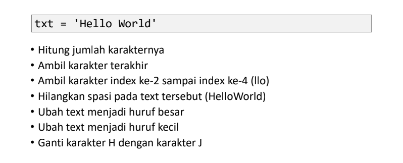
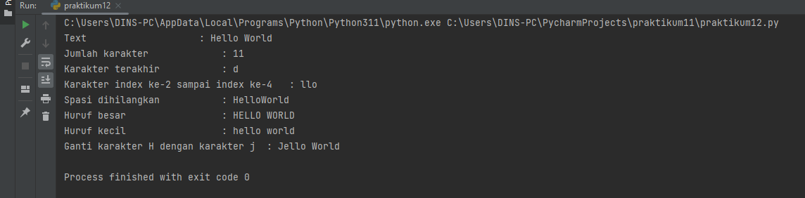
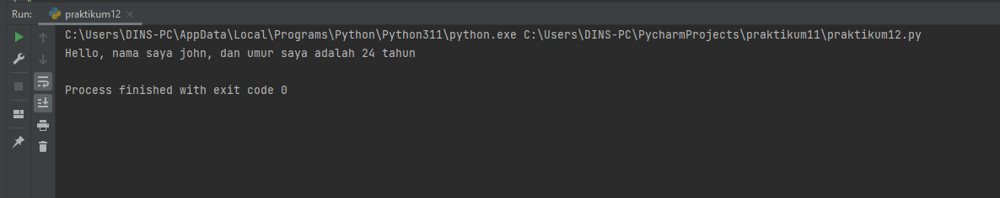

## TUGAS PERTEMUAN 14

Nama : Selma Ohoira

NIM : 312210727

Kelas : TI.22.C9

Mata Kuliah : Bahasa Pemograman

# PRAKTIKUM 12

Python String

- String adalah jenis yang paling populer di Python.
- Untuk membuatnya hanya dengan melampirkan karakter dalam tanda kutip.
- Python memperlakukan tanda kutip tunggal (' ') sama dengan tanda kutip ganda (" ").
- Membuat string semudah memberi nilai pada sebuah variabel.

## latihan 1

Penjelasan Latihan 1

Untuk menghitung jumlah karakter, gunakan fungsi len().

    # Menghitung jumlah karakternya
    print(len(txt))

Cara mengambil satu karakter pada string yaitu dengan menggunakan kurung siku [ ] dan deklarasi nomor di dalam kurung siku dengan urutan ARRAY dan menggunakan titik dua lalu masukan nomor ARRAY selanjutnya. Untuk mengambil karakter terakhir, gunakan index [-1]. Sedangkan untuk mengambil karakter index ke-2 sampai ke-4, gunakan index [2:5].

    # Mengambil karakter terakhir
    print(txt[-1])
    # Mengambil karakter index ke-2 sampai index ke-5
    print(txt[2:5])

Jika ingin menghilangkan spasi pada string, gunakan method replace(). Method replace() mengganti semua kemunculan string lama dengan yang baru atau paling banyak kemunculan.

Di dalam method replace, kita dapat menggunakan 2 cara, yang pertama bisa menggunakan (txt.replace(" ", "")) dan kedua dengan cara (txt.replace(txt[5], "")).

    # Menghilangkan spasi pada teks tersebut
    print(txt.replace(" ",""))

Untuk mengubah huruf menjadi besar, gunakan method upper(). Sedangkan jika ingin mengubah huruf menjadi kecil, gunakan method lower().

    # Mengubah teks menjadi huruf besar
    print(txt.upper())
    # Mengubah teks menjadi huruf kecil
    print(txt.lower())

Untuk mengganti karakter 'H' dengan karakter 'J', gunakan method replace().

    # Mengganti karakter
    print(txt.replace("H", "J"))

## Hasil output latihan1

    txt = 'Hello World'
    hitung = len(txt)
    terakhir = txt[-1]
    index = txt[2:5]
    hapus = txt.replace(' ', '')
    besar = txt.upper()
    kecil = txt.lower()
    ganti = txt.replace('H', 'J')

    print("Text \t\t\t\t\t: "+txt)
    print("Jumlah karakter \t\t\t:",hitung)
    print("Karakter terakhir \t\t\t: "+terakhir)
    print("Karakter index ke-2 sampai index ke-4 \t: "+index)
    print("Spasi dihilangkan \t\t\t: "+hapus)
    print("Huruf besar \t\t\t\t: "+besar)
    print("Huruf kecil \t\t\t\t: "+kecil)
    print("Ganti karakter H dengan karakter j \t: "+ganti)

## latihan 2
)

Hasil output

